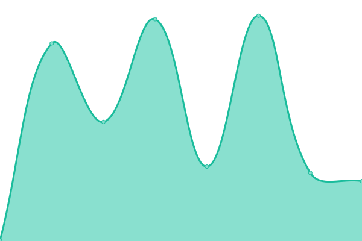
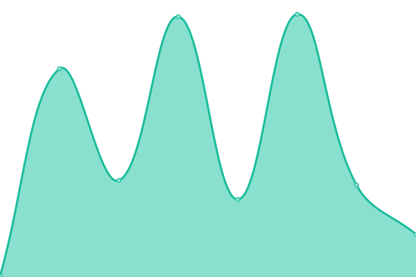
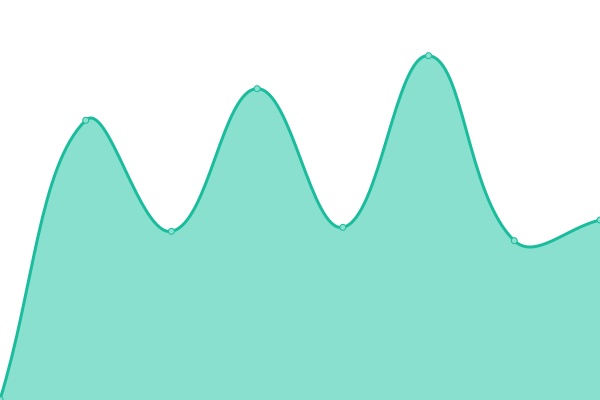
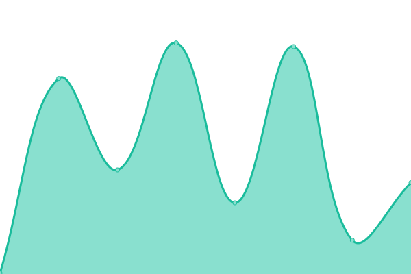

# [📈 Live Status](https://superwebpros.github.io/uptime): <!--live status--> **🟩 All systems operational**

This repository contains the open-source uptime monitor and status page for [SuperWebPros](https://www.superwebpros.com), powered by [Upptime](https://github.com/upptime/upptime).

With [Upptime](https://upptime.js.org), you can get your own unlimited and free uptime monitor and status page, powered entirely by a GitHub repository. We use [Issues](https://github.com/superwebpros/uptime/issues) as incident reports, [Actions](https://github.com/superwebpros/uptime/actions) as uptime monitors, and [Pages](https://superwebpros.github.io/uptime) for the status page.

<!--start: status pages-->
<!-- This summary is generated by Upptime (https://github.com/upptime/upptime) -->
<!-- Do not edit this manually, your changes will be overwritten -->
<!-- prettier-ignore -->
| URL | Status | History | Response Time | Uptime |
| --- | ------ | ------- | ------------- | ------ |
|  [Main Website](https://www.superwebpros.com) | 🟩 Up | [main-website.yml](https://github.com/superwebpros/uptime/commits/HEAD/history/main-website.yml) | 

 368ms
     
 | 

<a href="https://superwebpros.github.io/uptime/history/main-website">100.00%</a>
    

|  [ProHQ](https://app.superwebpros.com) | 🟩 Up | [pro-hq.yml](https://github.com/superwebpros/uptime/commits/HEAD/history/pro-hq.yml) | 

 276ms
     
 | 

<a href="https://superwebpros.github.io/uptime/history/pro-hq">100.00%</a>
    

|  [Budibase](https://tools.superwebpros.com) | 🟩 Up | [budibase.yml](https://github.com/superwebpros/uptime/commits/HEAD/history/budibase.yml) | 

 281ms
     
 | 

<a href="https://superwebpros.github.io/uptime/history/budibase">100.00%</a>
    

|  [n8n](https://n8n.superwebpros.com) | 🟩 Up | [n8n.yml](https://github.com/superwebpros/uptime/commits/HEAD/history/n8n.yml) | 

 210ms
     
 | 

<a href="https://superwebpros.github.io/uptime/history/n8n">100.00%</a>
    

|  [Baserow](https://br.superwebpros.com) | 🟩 Up | [baserow.yml](https://github.com/superwebpros/uptime/commits/HEAD/history/baserow.yml) | 

 1003ms
     
 | 

<a href="https://superwebpros.github.io/uptime/history/baserow">100.00%</a>
    

|  [Airbyte](https://ab.superwebpros.com) | 🟩 Up | [airbyte.yml](https://github.com/superwebpros/uptime/commits/HEAD/history/airbyte.yml) | 

 200ms
     
 | 

<a href="https://superwebpros.github.io/uptime/history/airbyte">100.00%</a>
    

|  [Playmakers Main](https://www.playmakers.com) | 🟩 Up | [playmakers-main.yml](https://github.com/superwebpros/uptime/commits/HEAD/history/playmakers-main.yml) | 

 359ms
     
 | 

<a href="https://superwebpros.github.io/uptime/history/playmakers-main">100.00%</a>
    

|  [Playmakers Store](https://shop.playmakers.com) | 🟩 Up | [playmakers-store.yml](https://github.com/superwebpros/uptime/commits/HEAD/history/playmakers-store.yml) | 

 232ms
     
 | 

<a href="https://superwebpros.github.io/uptime/history/playmakers-store">100.00%</a>
    

<!--end: status pages-->

[**Visit our status website →**](https://superwebpros.github.io/uptime)

## 📄 License

- Powered by: [Upptime](https://github.com/upptime/upptime)
- Code: [MIT](./LICENSE) © [SuperWebPros](https://www.superwebpros.com)
- Data in the `./history` directory: [Open Database License](https://opendatacommons.org/licenses/odbl/1-0/)
