# [📈 Live Status](https://superwebpros.github.io/uptime): <!--live status--> **🟧 Partial outage**

This repository contains the open-source uptime monitor and status page for [SuperWebPros](https://www.superwebpros.com), powered by [Upptime](https://github.com/upptime/upptime).

With [Upptime](https://upptime.js.org), you can get your own unlimited and free uptime monitor and status page, powered entirely by a GitHub repository. We use [Issues](https://github.com/superwebpros/uptime/issues) as incident reports, [Actions](https://github.com/superwebpros/uptime/actions) as uptime monitors, and [Pages](https://superwebpros.github.io/uptime) for the status page.

<!--start: status pages-->
<!-- This summary is generated by Upptime (https://github.com/upptime/upptime) -->
<!-- Do not edit this manually, your changes will be overwritten -->
<!-- prettier-ignore -->
| URL | Status | History | Response Time | Uptime |
| --- | ------ | ------- | ------------- | ------ |
|  [Main Website](https://www.superwebpros.com) | 🟩 Up | [main-website.yml](https://github.com/superwebpros/uptime/commits/HEAD/history/main-website.yml) | 

 310ms
     
 | 

<a href="https://superwebpros.github.io/uptime/history/main-website">100.00%</a>
    

|  [ProHQ](https://app.superwebpros.com) | 🟩 Up | [pro-hq.yml](https://github.com/superwebpros/uptime/commits/HEAD/history/pro-hq.yml) | 

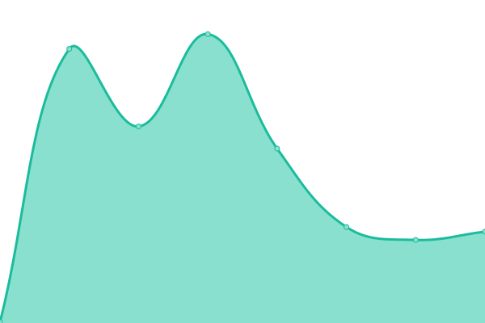 210ms
     
 | 

<a href="https://superwebpros.github.io/uptime/history/pro-hq">100.00%</a>
    

|  [Budibase](https://tools.superwebpros.com) | 🟩 Up | [budibase.yml](https://github.com/superwebpros/uptime/commits/HEAD/history/budibase.yml) | 

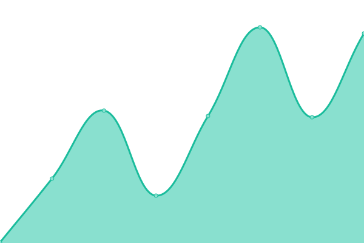 222ms
     
 | 

<a href="https://superwebpros.github.io/uptime/history/budibase">100.00%</a>
    

|  [n8n](https://n8n.superwebpros.com) | 🟩 Up | [n8n.yml](https://github.com/superwebpros/uptime/commits/HEAD/history/n8n.yml) | 

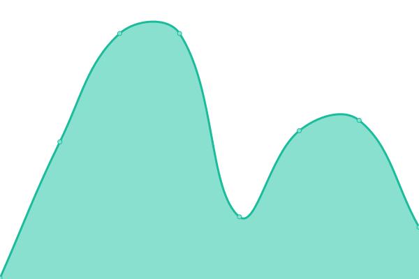 165ms
     
 | 

<a href="https://superwebpros.github.io/uptime/history/n8n">100.00%</a>
    

|  [Baserow](https://br.superwebpros.com) | 🟩 Up | [baserow.yml](https://github.com/superwebpros/uptime/commits/HEAD/history/baserow.yml) | 

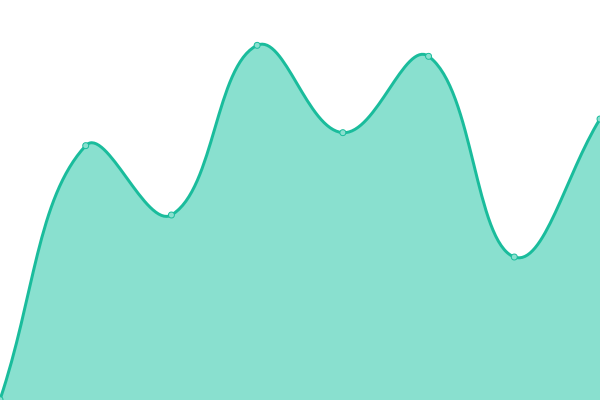 665ms
     
 | 

<a href="https://superwebpros.github.io/uptime/history/baserow">100.00%</a>
    

|  [Airbyte](https://ab.superwebpros.com) | 🟩 Up | [airbyte.yml](https://github.com/superwebpros/uptime/commits/HEAD/history/airbyte.yml) | 

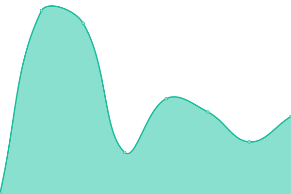 168ms
     
 | 

<a href="https://superwebpros.github.io/uptime/history/airbyte">100.00%</a>
    

|  [Mautic](https://mktg.superwebpros.com) | 🟩 Up | [mautic.yml](https://github.com/superwebpros/uptime/commits/HEAD/history/mautic.yml) | 

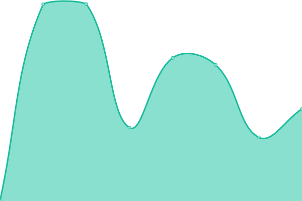 375ms
     
 | 

<a href="https://superwebpros.github.io/uptime/history/mautic">100.00%</a>
    

|  [Metabase](https://mb.superwebpros.com) | 🟩 Up | [metabase.yml](https://github.com/superwebpros/uptime/commits/HEAD/history/metabase.yml) | 

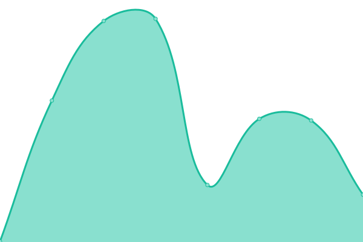 271ms
     
 | 

<a href="https://superwebpros.github.io/uptime/history/metabase">100.00%</a>
    

|  [PB](https://pb.superwebpros.com) | 🟩 Up | [pb.yml](https://github.com/superwebpros/uptime/commits/HEAD/history/pb.yml) | 

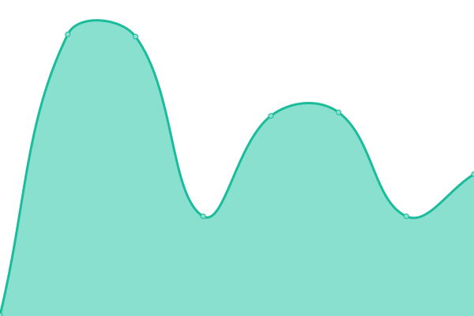 283ms
     
 | 

<a href="https://superwebpros.github.io/uptime/history/pb">100.00%</a>
    

|  [Playmakers Main](https://www.playmakers.com) | 🟩 Up | [playmakers-main.yml](https://github.com/superwebpros/uptime/commits/HEAD/history/playmakers-main.yml) | 

 320ms
     
 | 

<a href="https://superwebpros.github.io/uptime/history/playmakers-main">100.00%</a>
    

|  [Playmakers Store](https://shop.playmakers.com) | 🟩 Up | [playmakers-store.yml](https://github.com/superwebpros/uptime/commits/HEAD/history/playmakers-store.yml) | 

 351ms
     
 | 

<a href="https://superwebpros.github.io/uptime/history/playmakers-store">100.00%</a>
    

|  [Absolute Environmental Solutions](https://www.aesinspect.com) | 🟩 Up | [absolute-environmental-solutions.yml](https://github.com/superwebpros/uptime/commits/HEAD/history/absolute-environmental-solutions.yml) | 

 355ms
     
 | 

<a href="https://superwebpros.github.io/uptime/history/absolute-environmental-solutions">100.00%</a>
    

|  [MI Great Lakes Fishing](https://www.migreatlakesfish.com) | 🟩 Up | [mi-great-lakes-fishing.yml](https://github.com/superwebpros/uptime/commits/HEAD/history/mi-great-lakes-fishing.yml) | 

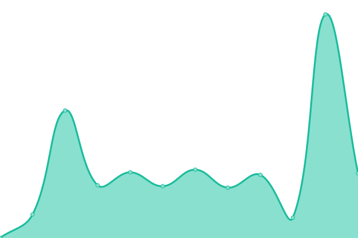 797ms
     
 | 

<a href="https://superwebpros.github.io/uptime/history/mi-great-lakes-fishing">100.00%</a>
    

|  [PhoRTE](https://www.phorte.org) | 🟩 Up | [pho-rte.yml](https://github.com/superwebpros/uptime/commits/HEAD/history/pho-rte.yml) | 

 333ms
     
 | 

<a href="https://superwebpros.github.io/uptime/history/pho-rte">100.00%</a>
    

|  [Living Water Ministries](https://www.elcalivingwater.com) | 🟩 Up | [living-water-ministries.yml](https://github.com/superwebpros/uptime/commits/HEAD/history/living-water-ministries.yml) | 

 361ms
     
 | 

<a href="https://superwebpros.github.io/uptime/history/living-water-ministries">100.00%</a>
    

|  [Eli's Project](https://www.elisproject.org) | 🟩 Up | [eli-s-project.yml](https://github.com/superwebpros/uptime/commits/HEAD/history/eli-s-project.yml) | 

 669ms
     
 | 

<a href="https://superwebpros.github.io/uptime/history/eli-s-project">100.00%</a>
    

|  [Confident Clinician](https://www.confidentclinician.com) | 🟩 Up | [confident-clinician.yml](https://github.com/superwebpros/uptime/commits/HEAD/history/confident-clinician.yml) | 

 297ms
     
 | 

<a href="https://superwebpros.github.io/uptime/history/confident-clinician">100.00%</a>
    

|  [MC - Fields of Growth](https://www.fieldsforgrowth.net) | 🟩 Up | [mc-fields-of-growth.yml](https://github.com/superwebpros/uptime/commits/HEAD/history/mc-fields-of-growth.yml) | 

 311ms
     
 | 

<a href="https://superwebpros.github.io/uptime/history/mc-fields-of-growth">100.00%</a>
    

|  [The Chick Hatchery](https://thechickhatchery.com) | 🟩 Up | [the-chick-hatchery.yml](https://github.com/superwebpros/uptime/commits/HEAD/history/the-chick-hatchery.yml) | 

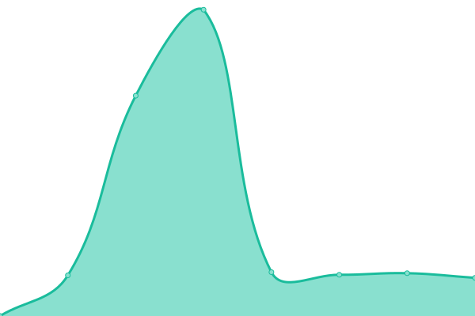 588ms
     
 | 

<a href="https://superwebpros.github.io/uptime/history/the-chick-hatchery">100.00%</a>
    

|  [Bart Moore](https://www.bartmooremusic.com) | 🟩 Up | [bart-moore.yml](https://github.com/superwebpros/uptime/commits/HEAD/history/bart-moore.yml) | 

 802ms
     
 | 

<a href="https://superwebpros.github.io/uptime/history/bart-moore">99.78%</a>
    

|  [Lucky Little Learners Main](https://luckylittlelearners.com) | 🟩 Up | [lucky-little-learners-main.yml](https://github.com/superwebpros/uptime/commits/HEAD/history/lucky-little-learners-main.yml) | 

 145ms
     
 | 

<a href="https://superwebpros.github.io/uptime/history/lucky-little-learners-main">100.00%</a>
    

|  [Luck Little Learners Shop](https://shop.luckylittlelearners.com) | 🟩 Up | [luck-little-learners-shop.yml](https://github.com/superwebpros/uptime/commits/HEAD/history/luck-little-learners-shop.yml) | 

 5678ms
     
 | 

<a href="https://superwebpros.github.io/uptime/history/luck-little-learners-shop">100.00%</a>
    

|  [Crenshaw Peterson](https://www.crenshawpeterson.com) | 🟩 Up | [crenshaw-peterson.yml](https://github.com/superwebpros/uptime/commits/HEAD/history/crenshaw-peterson.yml) | 

 310ms
     
 | 

<a href="https://superwebpros.github.io/uptime/history/crenshaw-peterson">100.00%</a>
    

|  [Michigan Veterinary Medical Association](https://www.michvma.org) | 🟩 Up | [michigan-veterinary-medical-association.yml](https://github.com/superwebpros/uptime/commits/HEAD/history/michigan-veterinary-medical-association.yml) | 

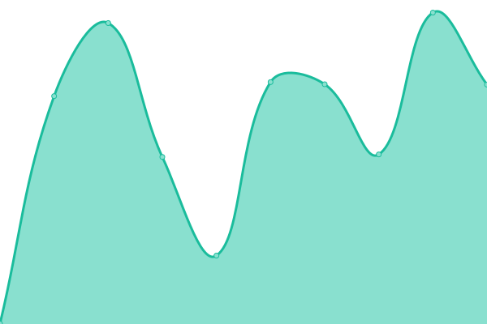 697ms
     
 | 

<a href="https://superwebpros.github.io/uptime/history/michigan-veterinary-medical-association">100.00%</a>
    

|  [Open Arms Link](https://www.openarmslink.com/) | 🟩 Up | [open-arms-link.yml](https://github.com/superwebpros/uptime/commits/HEAD/history/open-arms-link.yml) | 

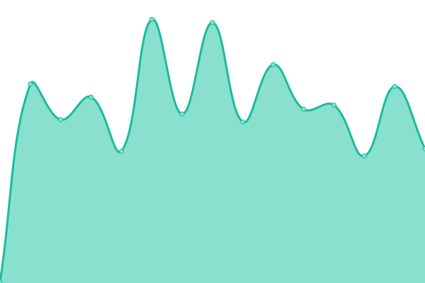 243ms
     
 | 

<a href="https://superwebpros.github.io/uptime/history/open-arms-link">100.00%</a>
    

|  [Acme Home Exteriors](https://acmehomeexteriors.com) | 🟩 Up | [acme-home-exteriors.yml](https://github.com/superwebpros/uptime/commits/HEAD/history/acme-home-exteriors.yml) | 

 260ms
     
 | 

<a href="https://superwebpros.github.io/uptime/history/acme-home-exteriors">100.00%</a>
    

|  [Last Light Search](https://www.lastlightsearch.com) | 🟩 Up | [last-light-search.yml](https://github.com/superwebpros/uptime/commits/HEAD/history/last-light-search.yml) | 

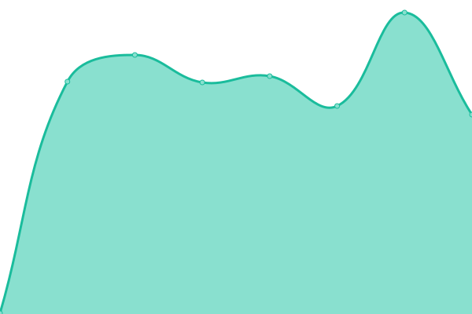 274ms
     
 | 

<a href="https://superwebpros.github.io/uptime/history/last-light-search">100.00%</a>
    

|  [East Hill Farm](https://east-hill-farm.com) | 🟩 Up | [east-hill-farm.yml](https://github.com/superwebpros/uptime/commits/HEAD/history/east-hill-farm.yml) | 

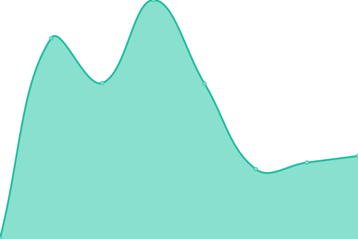 296ms
     
 | 

<a href="https://superwebpros.github.io/uptime/history/east-hill-farm">100.00%</a>
    

|  [ReKap Voice](https://www.rekapvoice.com) | 🟩 Up | [re-kap-voice.yml](https://github.com/superwebpros/uptime/commits/HEAD/history/re-kap-voice.yml) | 

 262ms
     
 | 

<a href="https://superwebpros.github.io/uptime/history/re-kap-voice">100.00%</a>
    

|  [Chris Stewart](https://www.friendsofchrisstewart.com) | 🟩 Up | [chris-stewart.yml](https://github.com/superwebpros/uptime/commits/HEAD/history/chris-stewart.yml) | 

 404ms
     
 | 

<a href="https://superwebpros.github.io/uptime/history/chris-stewart">0.00%</a>
    

|  [The Gillespie Company](https://www.gillespie-group.com) | 🟩 Up | [the-gillespie-company.yml](https://github.com/superwebpros/uptime/commits/HEAD/history/the-gillespie-company.yml) | 

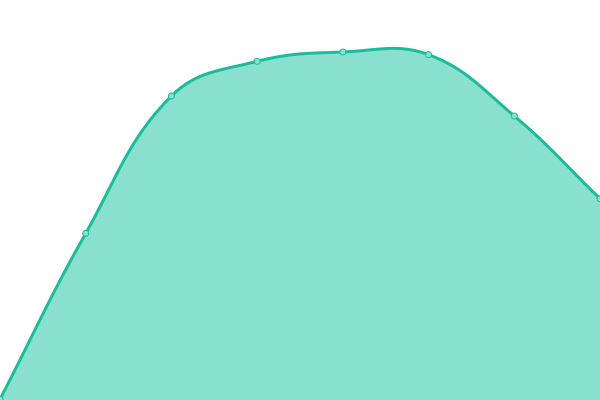 387ms
     
 | 

<a href="https://superwebpros.github.io/uptime/history/the-gillespie-company">100.00%</a>
    

|  [Footprints of Michigan](https://www.footprintsofmichigan.org) | 🟩 Up | [footprints-of-michigan.yml](https://github.com/superwebpros/uptime/commits/HEAD/history/footprints-of-michigan.yml) | 

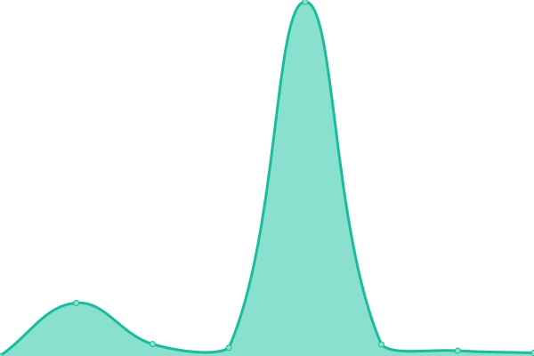 367ms
     
 | 

<a href="https://superwebpros.github.io/uptime/history/footprints-of-michigan">69.53%</a>
    

|  [mConnexions - Mid-Michigan Treatment Court Foundation](https://www.mid-michigantreatmentcourtsfoundation.org) | 🟩 Up | [m-connexions-mid-michigan-treatment-court-foundation.yml](https://github.com/superwebpros/uptime/commits/HEAD/history/m-connexions-mid-michigan-treatment-court-foundation.yml) | 

 304ms
     
 | 

<a href="https://superwebpros.github.io/uptime/history/m-connexions-mid-michigan-treatment-court-foundation">100.00%</a>
    

|  [Michigan Animal Health Foundation](https://www.michanimalhealthfoundation.org) | 🟩 Up | [michigan-animal-health-foundation.yml](https://github.com/superwebpros/uptime/commits/HEAD/history/michigan-animal-health-foundation.yml) | 

 311ms
     
 | 

<a href="https://superwebpros.github.io/uptime/history/michigan-animal-health-foundation">0.00%</a>
    

|  [NBHW (Neurobehaviorial Health & Wellness)](https://www.nbhealthandwellness.com) | 🟩 Up | [nbhw-neurobehaviorial-health-and-wellness.yml](https://github.com/superwebpros/uptime/commits/HEAD/history/nbhw-neurobehaviorial-health-and-wellness.yml) | 

 295ms
     
 | 

<a href="https://superwebpros.github.io/uptime/history/nbhw-neurobehaviorial-health-and-wellness">100.00%</a>
    

|  [Patten Place](https://www.pattenplace.com) | 🟩 Up | [patten-place.yml](https://github.com/superwebpros/uptime/commits/HEAD/history/patten-place.yml) | 

 246ms
     
 | 

<a href="https://superwebpros.github.io/uptime/history/patten-place">100.00%</a>
    

|  [Habitat for Humanity - Capital Area](https://www.habitatcr.org) | 🟩 Up | [habitat-for-humanity-capital-area.yml](https://github.com/superwebpros/uptime/commits/HEAD/history/habitat-for-humanity-capital-area.yml) | 

 426ms
     
 | 

<a href="https://superwebpros.github.io/uptime/history/habitat-for-humanity-capital-area">100.00%</a>
    

|  [The Meta Center](https://www.metactr.com) | 🟩 Up | [the-meta-center.yml](https://github.com/superwebpros/uptime/commits/HEAD/history/the-meta-center.yml) | 

 302ms
     
 | 

<a href="https://superwebpros.github.io/uptime/history/the-meta-center">100.00%</a>
    

|  [A Wee Publishing Co](https://aweepublishingco.com) | 🟩 Up | [a-wee-publishing-co.yml](https://github.com/superwebpros/uptime/commits/HEAD/history/a-wee-publishing-co.yml) | 

 388ms
     
 | 

<a href="https://superwebpros.github.io/uptime/history/a-wee-publishing-co">100.00%</a>
    

|  [Advanced Satellite](https://www.advancedsat.com) | 🟩 Up | [advanced-satellite.yml](https://github.com/superwebpros/uptime/commits/HEAD/history/advanced-satellite.yml) | 

 3099ms
     
 | 

<a href="https://superwebpros.github.io/uptime/history/advanced-satellite">99.43%</a>
    

|  [PaladinID, LLC](https://paladinid.com) | 🟩 Up | [paladin-id-llc.yml](https://github.com/superwebpros/uptime/commits/HEAD/history/paladin-id-llc.yml) | 

 722ms
     
 | 

<a href="https://superwebpros.github.io/uptime/history/paladin-id-llc">100.00%</a>
    

|  [McNair Construction](https://www.mcnairbuilds.com) | 🟩 Up | [mc-nair-construction.yml](https://github.com/superwebpros/uptime/commits/HEAD/history/mc-nair-construction.yml) | 

 309ms
     
 | 

<a href="https://superwebpros.github.io/uptime/history/mc-nair-construction">100.00%</a>
    

|  [Sunrise Seamless](https://www.sunriseseamless.com) | 🟩 Up | [sunrise-seamless.yml](https://github.com/superwebpros/uptime/commits/HEAD/history/sunrise-seamless.yml) | 

 280ms
     
 | 

<a href="https://superwebpros.github.io/uptime/history/sunrise-seamless">100.00%</a>
    

|  [Bluestone Executive Communications](https://www.bluestoneexec.com) | 🟩 Up | [bluestone-executive-communications.yml](https://github.com/superwebpros/uptime/commits/HEAD/history/bluestone-executive-communications.yml) | 

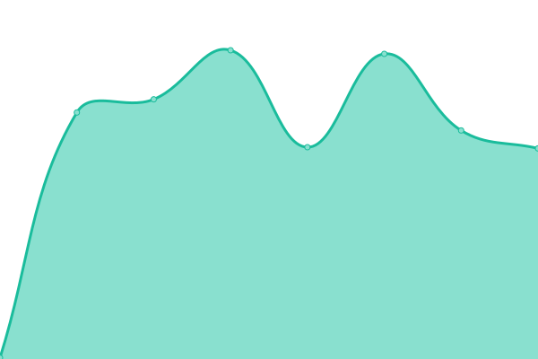 286ms
     
 | 

<a href="https://superwebpros.github.io/uptime/history/bluestone-executive-communications">100.00%</a>
    

|  [Greater Lansing Hispanic Chamber](https://www.glhchamber.org) | 🟩 Up | [greater-lansing-hispanic-chamber.yml](https://github.com/superwebpros/uptime/commits/HEAD/history/greater-lansing-hispanic-chamber.yml) | 

 305ms
     
 | 

<a href="https://superwebpros.github.io/uptime/history/greater-lansing-hispanic-chamber">100.00%</a>
    

|  [Gibson School of Highland Dance](https://gibsonhighlanddance.com) | 🟥 Down | [gibson-school-of-highland-dance.yml](https://github.com/superwebpros/uptime/commits/HEAD/history/gibson-school-of-highland-dance.yml) | 

 101ms
     
 | 

<a href="https://superwebpros.github.io/uptime/history/gibson-school-of-highland-dance">0.00%</a>
    

|  [Debra Goldstein](https://www.debrahgoldstein.com) | 🟩 Up | [debra-goldstein.yml](https://github.com/superwebpros/uptime/commits/HEAD/history/debra-goldstein.yml) | 

 318ms
     
 | 

<a href="https://superwebpros.github.io/uptime/history/debra-goldstein">100.00%</a>
    

|  [Freddie's Joint](https://www.freddiesjoint.com) | 🟩 Up | [freddie-s-joint.yml](https://github.com/superwebpros/uptime/commits/HEAD/history/freddie-s-joint.yml) | 

 303ms
     
 | 

<a href="https://superwebpros.github.io/uptime/history/freddie-s-joint">100.00%</a>
    

|  [People Sense Consulting](https://www.peoplesenseconsulting.com) | 🟩 Up | [people-sense-consulting.yml](https://github.com/superwebpros/uptime/commits/HEAD/history/people-sense-consulting.yml) | 

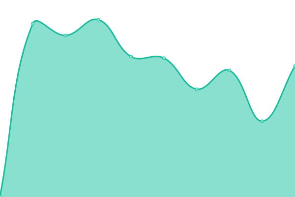 276ms
     
 | 

<a href="https://superwebpros.github.io/uptime/history/people-sense-consulting">100.00%</a>
    

|  [The Artist's Umbrella](https://theartistsumbrella.us) | 🟩 Up | [the-artist-s-umbrella.yml](https://github.com/superwebpros/uptime/commits/HEAD/history/the-artist-s-umbrella.yml) | 

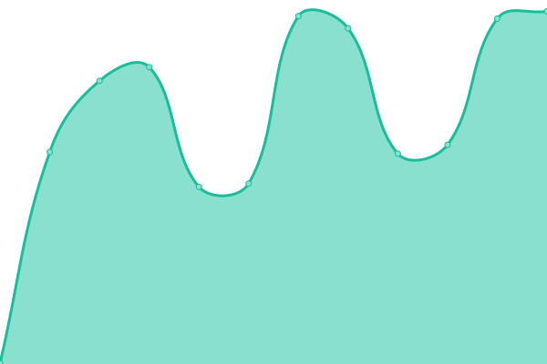 338ms
     
 | 

<a href="https://superwebpros.github.io/uptime/history/the-artist-s-umbrella">100.00%</a>
    

|  [Cabinet Place Online](https://www.cabinetplaceonline.com) | 🟩 Up | [cabinet-place-online.yml](https://github.com/superwebpros/uptime/commits/HEAD/history/cabinet-place-online.yml) | 

 353ms
     
 | 

<a href="https://superwebpros.github.io/uptime/history/cabinet-place-online">100.00%</a>
    

|  [Sales Coaches Corner](https://www.salescoachescorner.com) | 🟩 Up | [sales-coaches-corner.yml](https://github.com/superwebpros/uptime/commits/HEAD/history/sales-coaches-corner.yml) | 

 338ms
     
 | 

<a href="https://superwebpros.github.io/uptime/history/sales-coaches-corner">100.00%</a>
    

|  [IPM Inc.](https://www.ipm-inc.com) | 🟩 Up | [ipm-inc.yml](https://github.com/superwebpros/uptime/commits/HEAD/history/ipm-inc.yml) | 

 1182ms
     
 | 

<a href="https://superwebpros.github.io/uptime/history/ipm-inc">100.00%</a>
    

|  [Help U Move Hawaii](https://www.help-u-movehawaii.com) | 🟩 Up | [help-u-move-hawaii.yml](https://github.com/superwebpros/uptime/commits/HEAD/history/help-u-move-hawaii.yml) | 

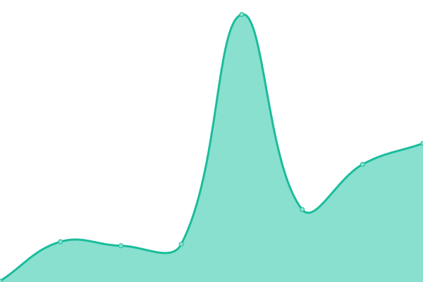 208ms
     
 | 

<a href="https://superwebpros.github.io/uptime/history/help-u-move-hawaii">100.00%</a>
    

|  [Monster Xtracts](https://www.monsterxtracts.com) | 🟩 Up | [monster-xtracts.yml](https://github.com/superwebpros/uptime/commits/HEAD/history/monster-xtracts.yml) | 

 569ms
     
 | 

<a href="https://superwebpros.github.io/uptime/history/monster-xtracts">100.00%</a>
    

|  [Jacksons Moving, LLC](https://www.jacksonsmovingllc.com) | 🟩 Up | [jacksons-moving-llc.yml](https://github.com/superwebpros/uptime/commits/HEAD/history/jacksons-moving-llc.yml) | 

 188ms
     
 | 

<a href="https://superwebpros.github.io/uptime/history/jacksons-moving-llc">0.00%</a>
    

|  [Ground Master Lawn & Snow](https://www.groundmasterlawnandsnow.com/) | 🟩 Up | [ground-master-lawn-and-snow.yml](https://github.com/superwebpros/uptime/commits/HEAD/history/ground-master-lawn-and-snow.yml) | 

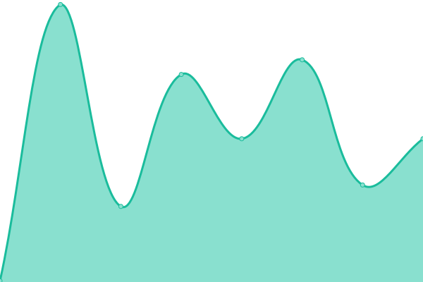 186ms
     
 | 

<a href="https://superwebpros.github.io/uptime/history/ground-master-lawn-and-snow">100.00%</a>
    

|  [mConnexions](https://www.mconnexions.com) | 🟩 Up | [m-connexions.yml](https://github.com/superwebpros/uptime/commits/HEAD/history/m-connexions.yml) | 

 316ms
     
 | 

<a href="https://superwebpros.github.io/uptime/history/m-connexions">100.00%</a>
    

|  [Strokes by Red](https://www.strokesbyred.com) | 🟩 Up | [strokes-by-red.yml](https://github.com/superwebpros/uptime/commits/HEAD/history/strokes-by-red.yml) | 

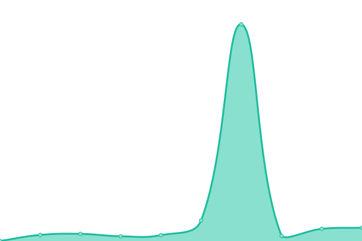 613ms
     
 | 

<a href="https://superwebpros.github.io/uptime/history/strokes-by-red">100.00%</a>
    

|  [Loyal Yak/Shoe Sling](https://getshoesling.com) | 🟩 Up | [loyal-yak-shoe-sling.yml](https://github.com/superwebpros/uptime/commits/HEAD/history/loyal-yak-shoe-sling.yml) | 

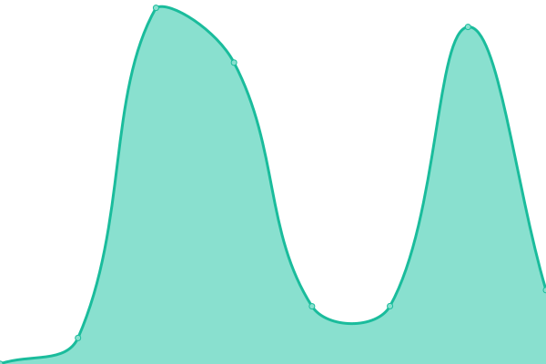 1387ms
     
 | 

<a href="https://superwebpros.github.io/uptime/history/loyal-yak-shoe-sling">100.00%</a>
    

|  [Above the Roots](https://www.abovetherootsmi.com) | 🟩 Up | [above-the-roots.yml](https://github.com/superwebpros/uptime/commits/HEAD/history/above-the-roots.yml) | 

 320ms
     
 | 

<a href="https://superwebpros.github.io/uptime/history/above-the-roots">99.71%</a>
    

|  [Mima Remedies](https://www.mimaremedies.com) | 🟩 Up | [mima-remedies.yml](https://github.com/superwebpros/uptime/commits/HEAD/history/mima-remedies.yml) | 

 230ms
     
 | 

<a href="https://superwebpros.github.io/uptime/history/mima-remedies">100.00%</a>
    

|  [MSB Holdings](https://www.msbholdings.com) | 🟩 Up | [msb-holdings.yml](https://github.com/superwebpros/uptime/commits/HEAD/history/msb-holdings.yml) | 

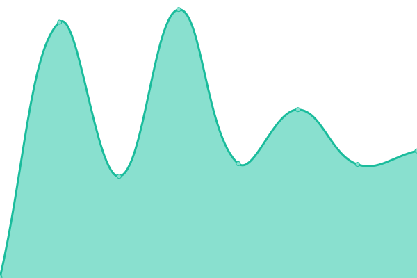 239ms
     
 | 

<a href="https://superwebpros.github.io/uptime/history/msb-holdings">100.00%</a>
    

|  [NAI Mid-Michigan](https://www.naimidmichigan.com) | 🟩 Up | [nai-mid-michigan.yml](https://github.com/superwebpros/uptime/commits/HEAD/history/nai-mid-michigan.yml) | 

 320ms
     
 | 

<a href="https://superwebpros.github.io/uptime/history/nai-mid-michigan">100.00%</a>
    

|  [Wolverine Water Systems](https://www.wolverinewatersystems.com) | 🟩 Up | [wolverine-water-systems.yml](https://github.com/superwebpros/uptime/commits/HEAD/history/wolverine-water-systems.yml) | 

 294ms
     
 | 

<a href="https://superwebpros.github.io/uptime/history/wolverine-water-systems">100.00%</a>
    

|  [Capital Area Humane Society](https://www.cahs-lansing.org) | 🟩 Up | [capital-area-humane-society.yml](https://github.com/superwebpros/uptime/commits/HEAD/history/capital-area-humane-society.yml) | 

 314ms
     
 | 

<a href="https://superwebpros.github.io/uptime/history/capital-area-humane-society">100.00%</a>
    

|  [Earth to Malibu](https://earthtomalibu.com) | 🟩 Up | [earth-to-malibu.yml](https://github.com/superwebpros/uptime/commits/HEAD/history/earth-to-malibu.yml) | 

 185ms
     
 | 

<a href="https://superwebpros.github.io/uptime/history/earth-to-malibu">100.00%</a>
    

|  [Front Room Underfashions](https://frontroomunderfashions.com) | 🟩 Up | [front-room-underfashions.yml](https://github.com/superwebpros/uptime/commits/HEAD/history/front-room-underfashions.yml) | 

 758ms
     
 | 

<a href="https://superwebpros.github.io/uptime/history/front-room-underfashions">100.00%</a>
    

|  [Transpac](https://www.gotranspac.com) | 🟩 Up | [transpac.yml](https://github.com/superwebpros/uptime/commits/HEAD/history/transpac.yml) | 

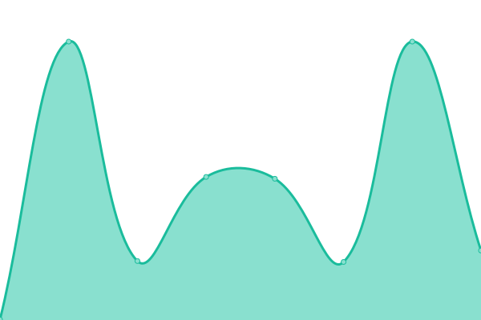 332ms
     
 | 

<a href="https://superwebpros.github.io/uptime/history/transpac">100.00%</a>
    

|  [The Izzo Legacy](https://www.izzolegacy.com) | 🟩 Up | [the-izzo-legacy.yml](https://github.com/superwebpros/uptime/commits/HEAD/history/the-izzo-legacy.yml) | 

 252ms
     
 | 

<a href="https://superwebpros.github.io/uptime/history/the-izzo-legacy">100.00%</a>
    

|  [Sportspeed](https://www.sportspeed.com) | 🟩 Up | [sportspeed.yml](https://github.com/superwebpros/uptime/commits/HEAD/history/sportspeed.yml) | 

 320ms
     
 | 

<a href="https://superwebpros.github.io/uptime/history/sportspeed">100.00%</a>
    

|  [Jesse's Personal Account](https://jesse-flores.com) | 🟩 Up | [jesse-s-personal-account.yml](https://github.com/superwebpros/uptime/commits/HEAD/history/jesse-s-personal-account.yml) | 

 349ms
     
 | 

<a href="https://superwebpros.github.io/uptime/history/jesse-s-personal-account">100.00%</a>
    

|  [Toby White Law](https://tobywhitelaw.com) | 🟩 Up | [toby-white-law.yml](https://github.com/superwebpros/uptime/commits/HEAD/history/toby-white-law.yml) | 

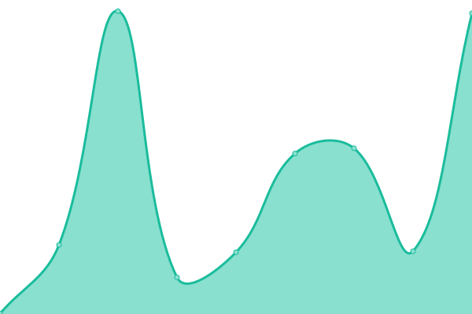 498ms
     
 | 

<a href="https://superwebpros.github.io/uptime/history/toby-white-law">100.00%</a>
    

|  [ePIFanyNow](https://epifanynow.org) | 🟩 Up | [e-pi-fany-now.yml](https://github.com/superwebpros/uptime/commits/HEAD/history/e-pi-fany-now.yml) | 

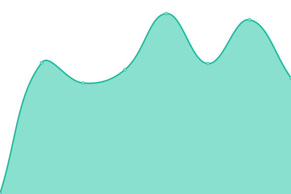 302ms
     
 | 

<a href="https://superwebpros.github.io/uptime/history/e-pi-fany-now">100.00%</a>
    

|  [Uno Deuce Media](https://unodeuce.com) | 🟩 Up | [uno-deuce-media.yml](https://github.com/superwebpros/uptime/commits/HEAD/history/uno-deuce-media.yml) | 

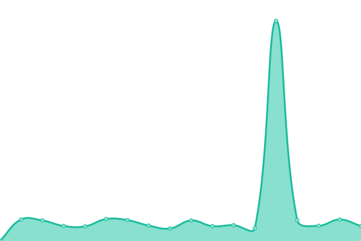 699ms
     
 | 

<a href="https://superwebpros.github.io/uptime/history/uno-deuce-media">100.00%</a>
    

|  [Weather Vane Roofing](https://www.weathervaneroofing.com) | 🟩 Up | [weather-vane-roofing.yml](https://github.com/superwebpros/uptime/commits/HEAD/history/weather-vane-roofing.yml) | 

 292ms
     
 | 

<a href="https://superwebpros.github.io/uptime/history/weather-vane-roofing">100.00%</a>
    

|  [Holt & Dimondale Agency](https://holtdimondaleagency.com) | 🟩 Up | [holt-and-dimondale-agency.yml](https://github.com/superwebpros/uptime/commits/HEAD/history/holt-and-dimondale-agency.yml) | 

 642ms
     
 | 

<a href="https://superwebpros.github.io/uptime/history/holt-and-dimondale-agency">100.00%</a>
    

|  [Thai Street Kitchen](https://www.thaistreetkitchen.com) | 🟩 Up | [thai-street-kitchen.yml](https://github.com/superwebpros/uptime/commits/HEAD/history/thai-street-kitchen.yml) | 

 305ms
     
 | 

<a href="https://superwebpros.github.io/uptime/history/thai-street-kitchen">100.00%</a>
    

|  [The Trainer's Studio](https://www.thetrainersstudio.com) | 🟩 Up | [the-trainer-s-studio.yml](https://github.com/superwebpros/uptime/commits/HEAD/history/the-trainer-s-studio.yml) | 

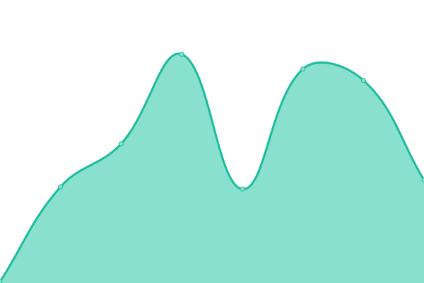 172ms
     
 | 

<a href="https://superwebpros.github.io/uptime/history/the-trainer-s-studio">100.00%</a>
    

|  [Preuss Pets](https://www.preusspets.com) | 🟩 Up | [preuss-pets.yml](https://github.com/superwebpros/uptime/commits/HEAD/history/preuss-pets.yml) | 

 316ms
     
 | 

<a href="https://superwebpros.github.io/uptime/history/preuss-pets">100.00%</a>
    

|  [Orange Insoles](https://orangeinsoles.com) | 🟩 Up | [orange-insoles.yml](https://github.com/superwebpros/uptime/commits/HEAD/history/orange-insoles.yml) | 

 489ms
     
 | 

<a href="https://superwebpros.github.io/uptime/history/orange-insoles">100.00%</a>
    

|  [Open Arms Link](https://www.openarmslink.com) | 🟩 Up | [open-arms-link.yml](https://github.com/superwebpros/uptime/commits/HEAD/history/open-arms-link.yml) | 

 243ms
     
 | 

<a href="https://superwebpros.github.io/uptime/history/open-arms-link">100.00%</a>
    

|  [Rufus Jackson Landing Page](https://insurancesavingsmichigan.com) | 🟩 Up | [rufus-jackson-landing-page.yml](https://github.com/superwebpros/uptime/commits/HEAD/history/rufus-jackson-landing-page.yml) | 

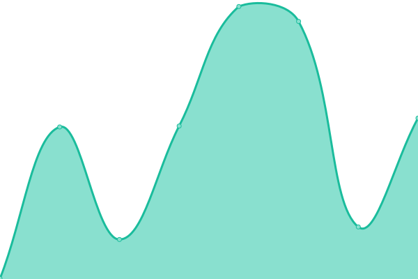 358ms
     
 | 

<a href="https://superwebpros.github.io/uptime/history/rufus-jackson-landing-page">100.00%</a>
    

|  [Prodigal Pilgrim](https://prodigalpilgrim.com) | 🟩 Up | [prodigal-pilgrim.yml](https://github.com/superwebpros/uptime/commits/HEAD/history/prodigal-pilgrim.yml) | 

 167ms
     
 | 

<a href="https://superwebpros.github.io/uptime/history/prodigal-pilgrim">100.00%</a>
    

|  [Snack Sized Fiction](https://snacksizefiction.com) | 🟩 Up | [snack-sized-fiction.yml](https://github.com/superwebpros/uptime/commits/HEAD/history/snack-sized-fiction.yml) | 

 427ms
     
 | 

<a href="https://superwebpros.github.io/uptime/history/snack-sized-fiction">100.00%</a>
    

|  [Allison Writing Website](https://www.allisonspoonerwriter.com) | 🟩 Up | [allison-writing-website.yml](https://github.com/superwebpros/uptime/commits/HEAD/history/allison-writing-website.yml) | 

 197ms
     
 | 

<a href="https://superwebpros.github.io/uptime/history/allison-writing-website">100.00%</a>
    

|  [Gods Dough](https://www.godsdough.com/) | 🟩 Up | [gods-dough.yml](https://github.com/superwebpros/uptime/commits/HEAD/history/gods-dough.yml) | 

 1110ms
     
 | 

<a href="https://superwebpros.github.io/uptime/history/gods-dough">0.00%</a>
    

|  [Crooked Trees Nursery](https://crookedtreenursery.com) | 🟩 Up | [crooked-trees-nursery.yml](https://github.com/superwebpros/uptime/commits/HEAD/history/crooked-trees-nursery.yml) | 

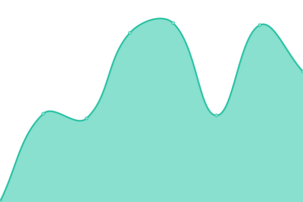 488ms
     
 | 

<a href="https://superwebpros.github.io/uptime/history/crooked-trees-nursery">100.00%</a>
    

|  [Metro Obgyn](https://www.metroobgyn.com) | 🟩 Up | [metro-obgyn.yml](https://github.com/superwebpros/uptime/commits/HEAD/history/metro-obgyn.yml) | 

 339ms
     
 | 

<a href="https://superwebpros.github.io/uptime/history/metro-obgyn">100.00%</a>
    

|  [Dy Dermatology - Wordpress](https://www.dydermatology.com) | 🟩 Up | [dy-dermatology-wordpress.yml](https://github.com/superwebpros/uptime/commits/HEAD/history/dy-dermatology-wordpress.yml) | 

 527ms
     
 | 

<a href="https://superwebpros.github.io/uptime/history/dy-dermatology-wordpress">100.00%</a>
    

|  [Dy Dermatoloty - Shopify](https://shop.dydermatology.com) | 🟩 Up | [dy-dermatoloty-shopify.yml](https://github.com/superwebpros/uptime/commits/HEAD/history/dy-dermatoloty-shopify.yml) | 

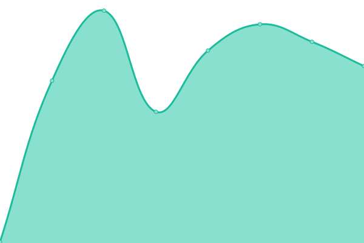 227ms
     
 | 

<a href="https://superwebpros.github.io/uptime/history/dy-dermatoloty-shopify">100.00%</a>
    

|  [SmileBond](https://www.smilebond.com) | 🟩 Up | [smile-bond.yml](https://github.com/superwebpros/uptime/commits/HEAD/history/smile-bond.yml) | 

 322ms
     
 | 

<a href="https://superwebpros.github.io/uptime/history/smile-bond">100.00%</a>
    

|  [Exterior Grounds Management](https://www.exteriorgroundsmanagement.com) | 🟩 Up | [exterior-grounds-management.yml](https://github.com/superwebpros/uptime/commits/HEAD/history/exterior-grounds-management.yml) | 

 311ms
     
 | 

<a href="https://superwebpros.github.io/uptime/history/exterior-grounds-management">0.00%</a>
    

|  [Shari Pash](https://sharipash.com) | 🟥 Down | [shari-pash.yml](https://github.com/superwebpros/uptime/commits/HEAD/history/shari-pash.yml) | 

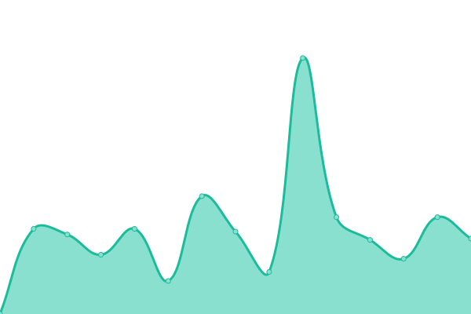 744ms
     
 | 

<a href="https://superwebpros.github.io/uptime/history/shari-pash">99.81%</a>
    

|  [Murphy & Spagnuolo](https://www.mbspclaw.com) | 🟩 Up | [murphy-and-spagnuolo.yml](https://github.com/superwebpros/uptime/commits/HEAD/history/murphy-and-spagnuolo.yml) | 

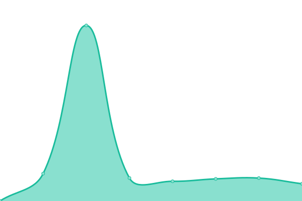 693ms
     
 | 

<a href="https://superwebpros.github.io/uptime/history/murphy-and-spagnuolo">100.00%</a>
    

|  [Fresh Pak](https://freshpakinc.com) | 🟩 Up | [fresh-pak.yml](https://github.com/superwebpros/uptime/commits/HEAD/history/fresh-pak.yml) | 

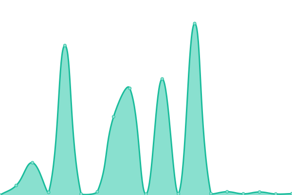 1066ms
     
 | 

<a href="https://superwebpros.github.io/uptime/history/fresh-pak">100.00%</a>
    

|  [Meta Center](https://www.metactr.com) | 🟩 Up | [meta-center.yml](https://github.com/superwebpros/uptime/commits/HEAD/history/meta-center.yml) | 

 225ms
     
 | 

<a href="https://superwebpros.github.io/uptime/history/meta-center">100.00%</a>
    

|  [Judge Flores](https://www.retaintonyfloresforjudge.com) | 🟥 Down | [judge-flores.yml](https://github.com/superwebpros/uptime/commits/HEAD/history/judge-flores.yml) | 

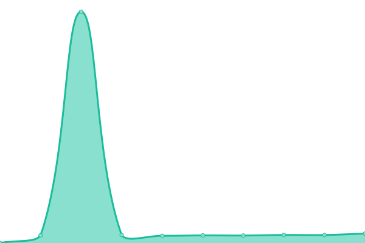 0ms
     
 | 

<a href="https://superwebpros.github.io/uptime/history/judge-flores">0.00%</a>
    

|  [SS - Groom Grub & Belly Rub](https://groomgr.superwebpros.com) | 🟩 Up | [ss-groom-grub-and-belly-rub.yml](https://github.com/superwebpros/uptime/commits/HEAD/history/ss-groom-grub-and-belly-rub.yml) | 

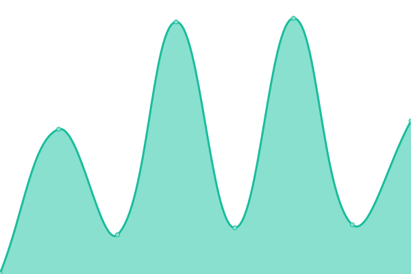 312ms
     
 | 

<a href="https://superwebpros.github.io/uptime/history/ss-groom-grub-and-belly-rub">100.00%</a>
    

|  [SS - Paws Spa](https://pawsspa.superwebpros.com) | 🟩 Up | [ss-paws-spa.yml](https://github.com/superwebpros/uptime/commits/HEAD/history/ss-paws-spa.yml) | 

 327ms
     
 | 

<a href="https://superwebpros.github.io/uptime/history/ss-paws-spa">100.00%</a>
    

|  [SS - Barking Lot](https://barking.superwebpros.com) | 🟩 Up | [ss-barking-lot.yml](https://github.com/superwebpros/uptime/commits/HEAD/history/ss-barking-lot.yml) | 

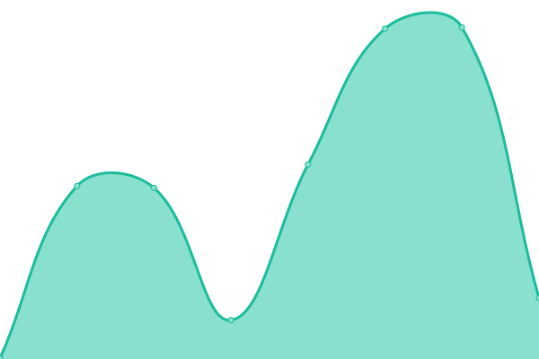 339ms
     
 | 

<a href="https://superwebpros.github.io/uptime/history/ss-barking-lot">100.00%</a>
    

|  [SS - Heavenly Paws](https://heavenl.superwebpros.com) | 🟩 Up | [ss-heavenly-paws.yml](https://github.com/superwebpros/uptime/commits/HEAD/history/ss-heavenly-paws.yml) | 

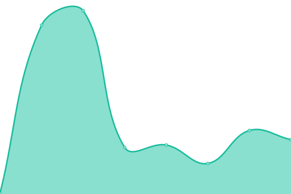 319ms
     
 | 

<a href="https://superwebpros.github.io/uptime/history/ss-heavenly-paws">100.00%</a>
    

|  [SS - Larry's Laundromutt](https://larrysl.superwebpros.com) | 🟩 Up | [ss-larry-s-laundromutt.yml](https://github.com/superwebpros/uptime/commits/HEAD/history/ss-larry-s-laundromutt.yml) | 

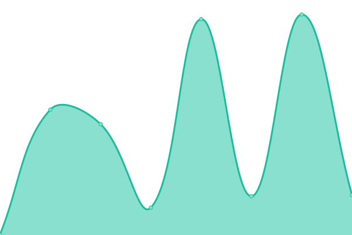 325ms
     
 | 

<a href="https://superwebpros.github.io/uptime/history/ss-larry-s-laundromutt">100.00%</a>
    

|  [SS - Fluff 'N Suds](https://fluffns.superwebpros.com) | 🟩 Up | [ss-fluff-n-suds.yml](https://github.com/superwebpros/uptime/commits/HEAD/history/ss-fluff-n-suds.yml) | 

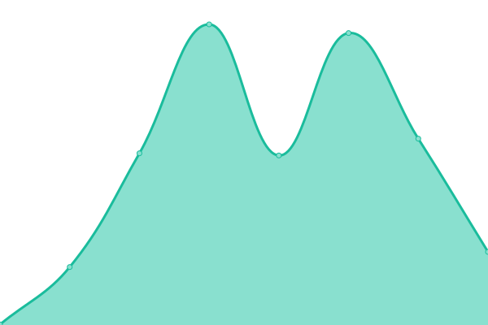 323ms
     
 | 

<a href="https://superwebpros.github.io/uptime/history/ss-fluff-n-suds">100.00%</a>
    

|  [SS - Pampered Paws](https://pampere.superwebpros.com) | 🟩 Up | [ss-pampered-paws.yml](https://github.com/superwebpros/uptime/commits/HEAD/history/ss-pampered-paws.yml) | 

 321ms
     
 | 

<a href="https://superwebpros.github.io/uptime/history/ss-pampered-paws">100.00%</a>
    

|  [SS - Dog's Day Out](https://dogsday.superwebpros.com) | 🟩 Up | [ss-dog-s-day-out.yml](https://github.com/superwebpros/uptime/commits/HEAD/history/ss-dog-s-day-out.yml) | 

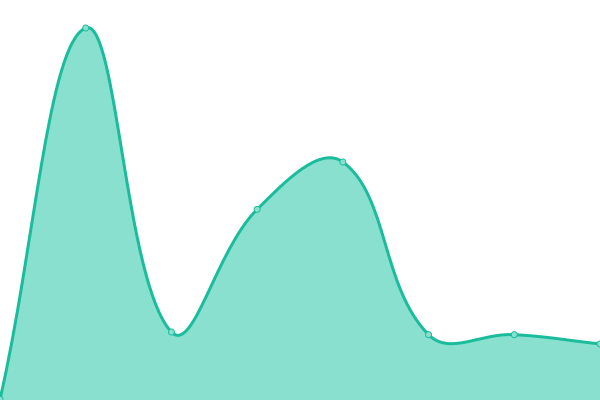 320ms
     
 | 

<a href="https://superwebpros.github.io/uptime/history/ss-dog-s-day-out">100.00%</a>
    

|  [SS - Vip Pet Spa](https://vippets.superwebpros.com) | 🟩 Up | [ss-vip-pet-spa.yml](https://github.com/superwebpros/uptime/commits/HEAD/history/ss-vip-pet-spa.yml) | 

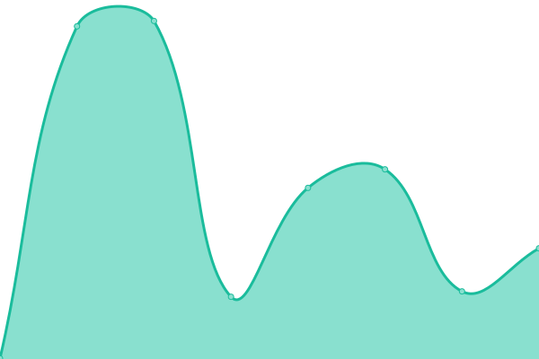 318ms
     
 | 

<a href="https://superwebpros.github.io/uptime/history/ss-vip-pet-spa">100.00%</a>
    

|  [SS - Heights Pet Grooming](https://heights.superwebpros.com) | 🟩 Up | [ss-heights-pet-grooming.yml](https://github.com/superwebpros/uptime/commits/HEAD/history/ss-heights-pet-grooming.yml) | 

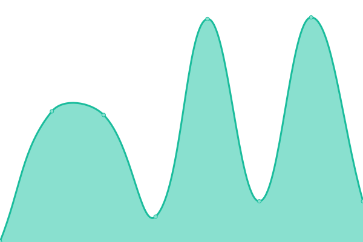 332ms
     
 | 

<a href="https://superwebpros.github.io/uptime/history/ss-heights-pet-grooming">100.00%</a>
    

|  [SS - Ruff's Luxury Inn](https://rufflux.superwebpros.com) | 🟩 Up | [ss-ruff-s-luxury-inn.yml](https://github.com/superwebpros/uptime/commits/HEAD/history/ss-ruff-s-luxury-inn.yml) | 

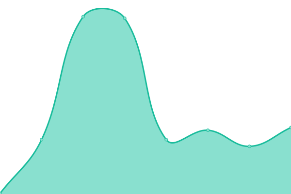 320ms
     
 | 

<a href="https://superwebpros.github.io/uptime/history/ss-ruff-s-luxury-inn">100.00%</a>
    

|  [SS - Dirty Paws](https://dirtypa.superwebpros.com) | 🟩 Up | [ss-dirty-paws.yml](https://github.com/superwebpros/uptime/commits/HEAD/history/ss-dirty-paws.yml) | 

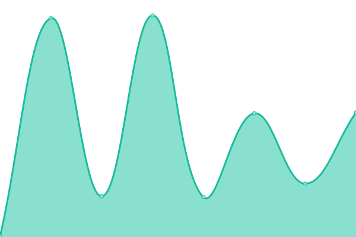 324ms
     
 | 

<a href="https://superwebpros.github.io/uptime/history/ss-dirty-paws">100.00%</a>
    

|  [SS - Fur The Love of Dogs](https://furthel.superwebpros.com) | 🟩 Up | [ss-fur-the-love-of-dogs.yml](https://github.com/superwebpros/uptime/commits/HEAD/history/ss-fur-the-love-of-dogs.yml) | 

 327ms
     
 | 

<a href="https://superwebpros.github.io/uptime/history/ss-fur-the-love-of-dogs">100.00%</a>
    

|  [SS - Kitty's Canine Clips](https://kittysc.superwebpros.com) | 🟩 Up | [ss-kitty-s-canine-clips.yml](https://github.com/superwebpros/uptime/commits/HEAD/history/ss-kitty-s-canine-clips.yml) | 

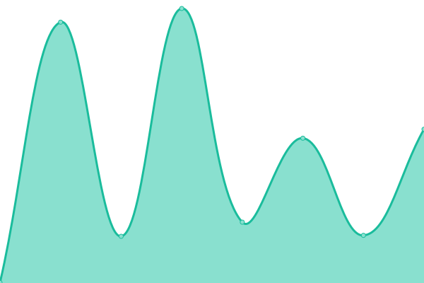 318ms
     
 | 

<a href="https://superwebpros.github.io/uptime/history/ss-kitty-s-canine-clips">0.00%</a>
    

|  [SS - Pets of Perfection](https://petsofp.superwebpros.com) | 🟩 Up | [ss-pets-of-perfection.yml](https://github.com/superwebpros/uptime/commits/HEAD/history/ss-pets-of-perfection.yml) | 

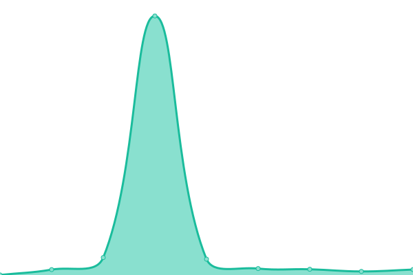 320ms
     
 | 

<a href="https://superwebpros.github.io/uptime/history/ss-pets-of-perfection">100.00%</a>
    

|  [SS - Your Dog's Best Friends](https://yourdog.superwebpros.com) | 🟩 Up | [ss-your-dog-s-best-friends.yml](https://github.com/superwebpros/uptime/commits/HEAD/history/ss-your-dog-s-best-friends.yml) | 

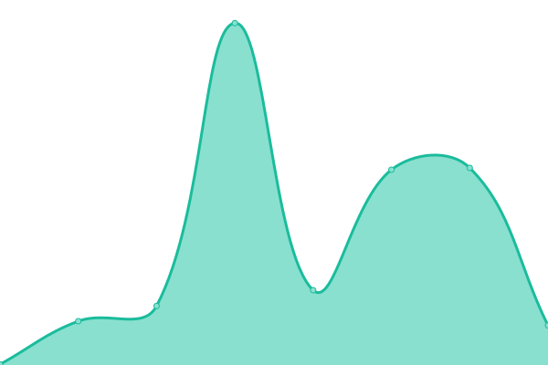 326ms
     
 | 

<a href="https://superwebpros.github.io/uptime/history/ss-your-dog-s-best-friends">0.00%</a>
    

|  [SS - Bonita Dog Grooming](https://bonitad.superwebpros.com) | 🟩 Up | [ss-bonita-dog-grooming.yml](https://github.com/superwebpros/uptime/commits/HEAD/history/ss-bonita-dog-grooming.yml) | 

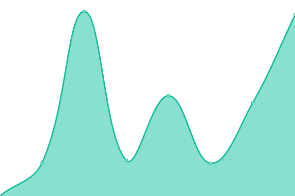 320ms
     
 | 

<a href="https://superwebpros.github.io/uptime/history/ss-bonita-dog-grooming">100.00%</a>
    

|  [SS - Fancy Paws](https://fancypa.superwebpros.com) | 🟩 Up | [ss-fancy-paws.yml](https://github.com/superwebpros/uptime/commits/HEAD/history/ss-fancy-paws.yml) | 

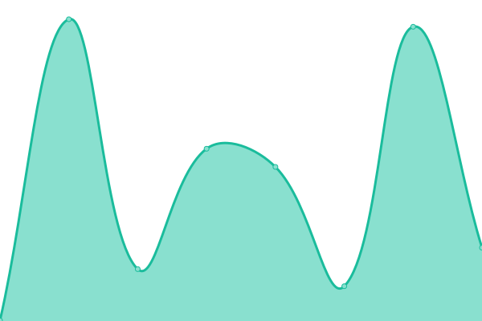 318ms
     
 | 

<a href="https://superwebpros.github.io/uptime/history/ss-fancy-paws">100.00%</a>
    

|  [SS - Club Pooch](https://clubpoo.superwebpros.com) | 🟩 Up | [ss-club-pooch.yml](https://github.com/superwebpros/uptime/commits/HEAD/history/ss-club-pooch.yml) | 

 316ms
     
 | 

<a href="https://superwebpros.github.io/uptime/history/ss-club-pooch">100.00%</a>
    

|  [SS - Mudpuppy's](https://mudpupp.superwebpros.com) | 🟩 Up | [ss-mudpuppy-s.yml](https://github.com/superwebpros/uptime/commits/HEAD/history/ss-mudpuppy-s.yml) | 

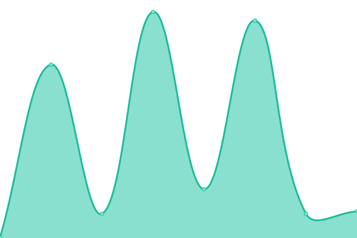 332ms
     
 | 

<a href="https://superwebpros.github.io/uptime/history/ss-mudpuppy-s">100.00%</a>
    

|  [SS - Pawfection](https://pawfect.superwebpros.com) | 🟩 Up | [ss-pawfection.yml](https://github.com/superwebpros/uptime/commits/HEAD/history/ss-pawfection.yml) | 

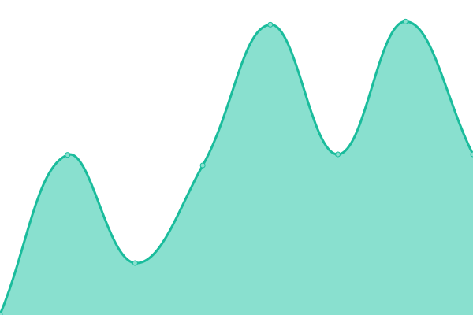 308ms
     
 | 

<a href="https://superwebpros.github.io/uptime/history/ss-pawfection">100.00%</a>
    

|  [SS - Suds 'Em Yourself](https://sudsemy.superwebpros.com) | 🟩 Up | [ss-suds-em-yourself.yml](https://github.com/superwebpros/uptime/commits/HEAD/history/ss-suds-em-yourself.yml) | 

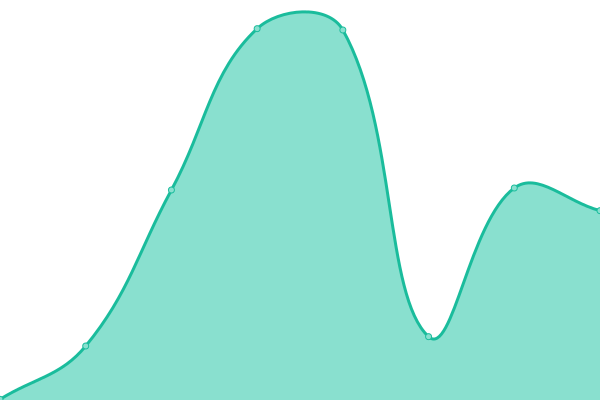 312ms
     
 | 

<a href="https://superwebpros.github.io/uptime/history/ss-suds-em-yourself">100.00%</a>
    

|  [SS - Annandale Pet Spa](https://annanda.superwebpros.com) | 🟩 Up | [ss-annandale-pet-spa.yml](https://github.com/superwebpros/uptime/commits/HEAD/history/ss-annandale-pet-spa.yml) | 

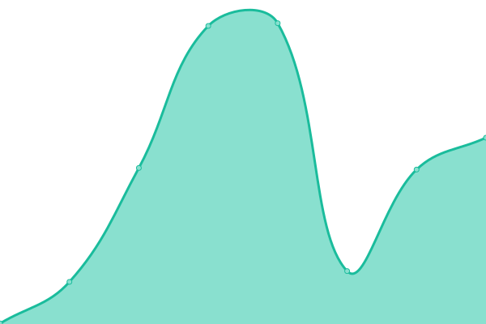 314ms
     
 | 

<a href="https://superwebpros.github.io/uptime/history/ss-annandale-pet-spa">100.00%</a>
    

<!--end: status pages-->

[**Visit our status website →**](https://superwebpros.github.io/uptime)

## 📄 License

- Powered by: [Upptime](https://github.com/upptime/upptime)
- Code: [MIT](./LICENSE) © [SuperWebPros](https://www.superwebpros.com)
- Data in the `./history` directory: [Open Database License](https://opendatacommons.org/licenses/odbl/1-0/)
